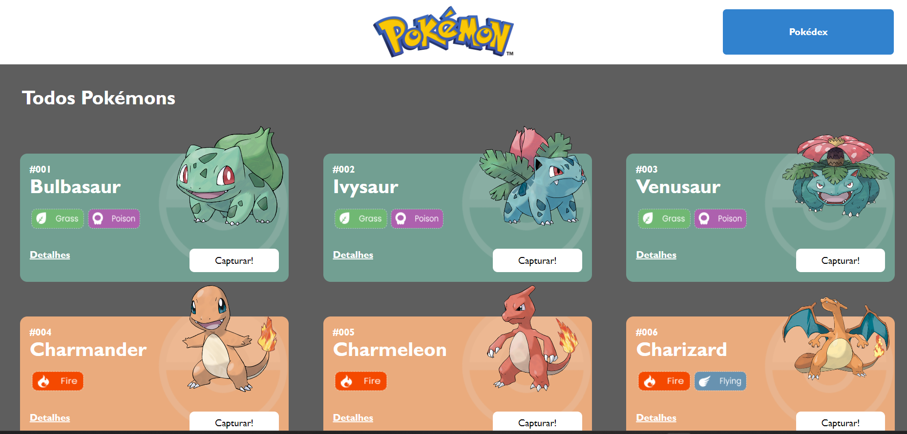
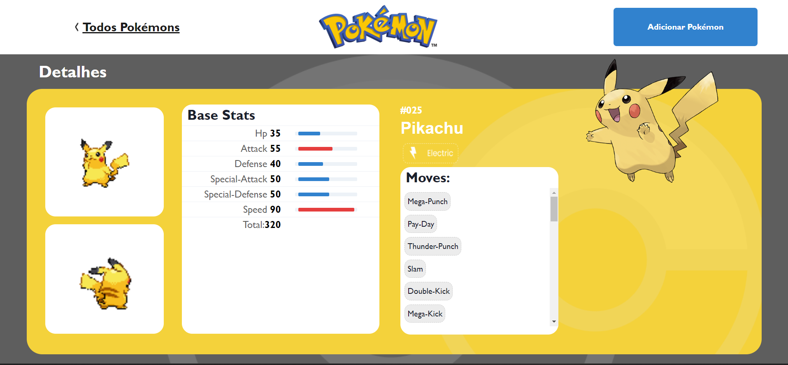
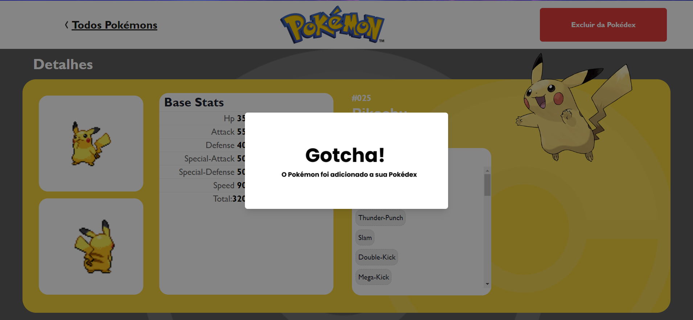
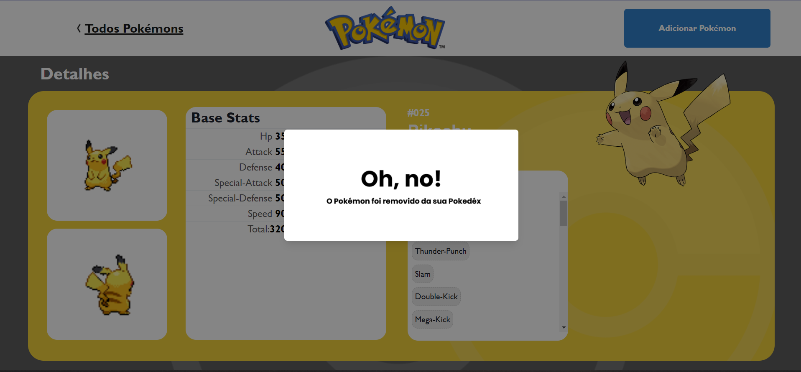
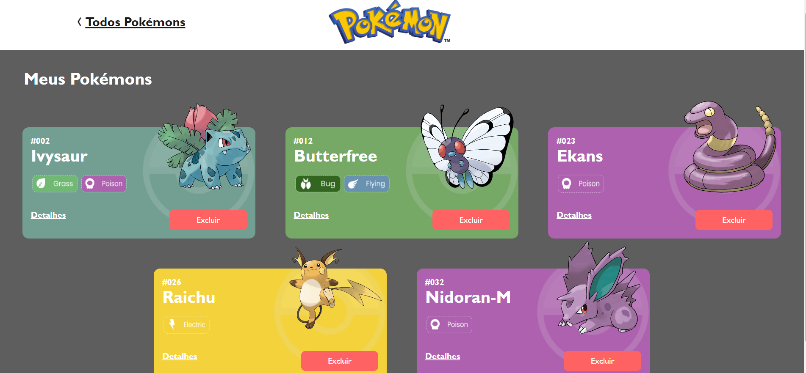
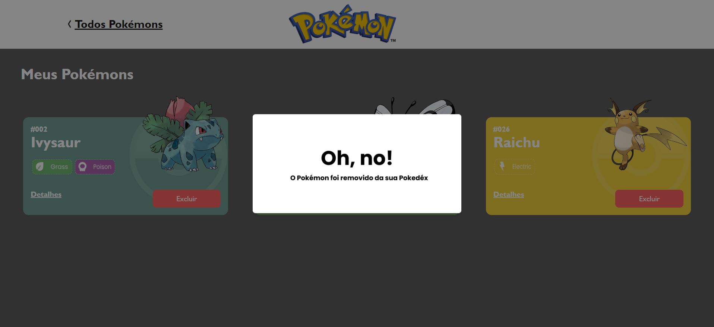
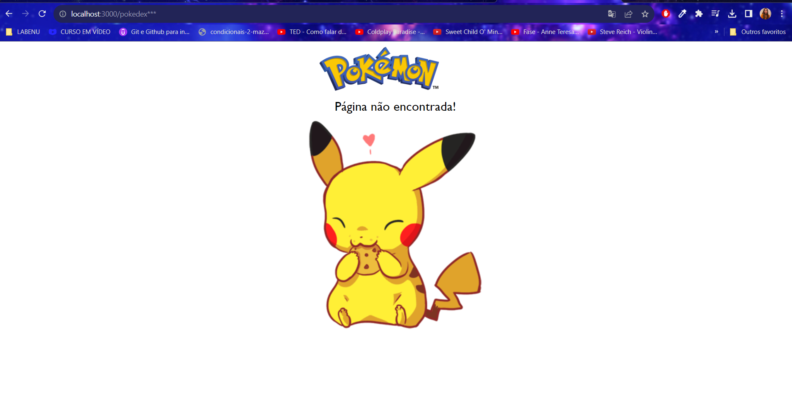

<h1 align="center">Projeto Pokedex</h1>

<p align="center">
  

  

  

  

  <!--  -->

  <!--  -->

  <!--  -->
</p>

<!-- Status -->

<!-- <h4 align="center"> 
	🚧  Projeto Pokedex 🚀 Em construção...  🚧
</h4> 

<hr> -->

<p align="center">
  <a href="#dart-sobre">Sobre</a> &#xa0; | &#xa0; 
  <a href="#sparkles-funcionalidades">Funcionalidades</a> &#xa0; | &#xa0;
  <a href="#rocket-tecnologias">Tecnologias</a> &#xa0; | &#xa0;
  <a href="#white_check_mark-pré-requisitos">Pré requisitos</a> &#xa0; | &#xa0;
  <a href="#checkered_flag-começando">Começando</a> &#xa0; | &#xa0;
  <a href="#memo-licença">Licença</a> &#xa0; | &#xa0;
  <a href="https://github.com/karinadarc" target="_blank">Autor</a>
</p>

<br>

## :dart: Sobre ##

O projeto "React e API's" é uma aplicação web focada no universo dos pokemons, utilizando como fonte de dados, a [Poke Api](https://pokeapi.co/ "Poke Api"). A estrutura do projeto abrange três páginas: Home, Pokédex e Detalhes.


## :sparkles: Funcionalidades ##

:heavy_check_mark: Na página **Home**, todos os cards estão disponíveis para visualização. Para saber informações detalhadas de algum pokémon, clique no link do Card **"Detalhes"**.


:heavy_check_mark: Para adicionar o pokémon a sua Página Pokédex, clique no botão do Card **"Capturar"** ou se estiver na página de Detalhes, você pode clicar no botão **"Adicionar Pokémon"** ou se quiser excluir, pode apertar no botão **"Excluir da Pokédex"**.

:heavy_check_mark:Para acessar a lista de pokémons capturados, basta clicar no botão **"Pokédex"** localizado na página Home. Atavés dele é possível acessar a página de detalhes novamente e excluir ou adicionar novamente a Pokédex.

## :rocket: Tecnologias ##

Todo o projeto foi organizado e estilizado através do modelo fornecido pela Labenu que foi disponibilizado no figma. Em sintonia com os tópicos abordados ao longo do Módulo de Frontend, destaco as principais ferramentas e técnicas ultilizadas:

- [Axios](https://axios-http.com/)
- [React](https://pt-br.reactjs.org/)
- [Chakra](https://chakra-ui.com/docs/components/divider)
- [Node](https://nodejs.org/en/)
- [Poke Api](https://pokeapi.co/ "Poke Api")
- [Styled-components](https://styled-components.com/)
- [Figma](https://www.figma.com/)

## :dart: Requisitos ##
- **Gerais:**
	- [x] O site deve ter 3 páginas: Home, Pokedex e Detalhes;
	- [x] Projeto deve seguir o [design](https://www.figma.com/file/KseyA2Ofghiek2Cy3ZaDre/Poked%C3%A9x?t=AEi3zEmWmarf1FbP-0 "design") proposto;
	- [x] O fluxo de trocas de páginas devem ser semelhante ao [fluxograma](https://www.figma.com/proto/KseyA2Ofghiek2Cy3ZaDre/Poked%C3%A9x?page-id=0%3A1&node-id=2%3A2&viewport=358%2C197%2C0.27&scaling=scale-down&starting-point-node-id=2%3A2 "fluxograma");
- **Página Home:**
	- [x]  Mostrar uma lista de Pokemons, contendo ao menos 20 Pokemons;
	- [x] Cada Pokemon será representado por um Card;
	- [x] Em cada card de Pokemon tem um botão para adicioná-lo à Pokedex e um outro botão para acessar os detalhes do Pokemon;
	- [x] Header dessa página terá um botão para acessar a página da Pokedex
- **Página Pokédex**
	- [x] Renderizar a lista de pokémons adicionados na pokedex;
	- [x] Em cada card de Pokemon deve ter um botão para removê-lo da Pokedex e um outro botão para acessar os detalhes do Pokemon.
	- [x] Header deve ter um botão para voltar para a Home
	- [x] Não deve ser possível adicionar o mesmo Pokemon duas vezes na Pokedex
- **Página de Detalhes**
	- [x] Mostrar os detalhes do Pokemon selecionado, com informações descritas
	- [x] Header deve ter um botão para adicionar ou remover da Pokedex e outro para voltar a página home.


## Link do deploy:
[Vercel - Karina D'arc](https://projeto-react-apis-six-iota.vercel.app/)


## Captura de tela do projeto ##









## :white_check_mark: Pré requisitos ##
Antes de começar :checkered_flag:, você precisa ter o [Git](https://git-scm.com) e o [Node](https://nodejs.org/en/) instalados em sua maquina.

```bash
# Clone este repositório
$ git clone https://github.com/karinadarc/projeto-pokedex

# Entre na pasta
$ cd projeto-pokedex

# Instale as dependências
$ npm install

# Para iniciar o projeto
$ npm start

# O app vai inicializar em <http://localhost:3000>
```

## :memo: Licença ##

Este projeto está sob licença MIT. Veja o arquivo [LICENSE](LICENSE.md) para mais detalhes.


Feito com :heart: por <a href="https://www.linkedin.com/in/karina-darc/" target="_blank">Karina D&#39;arc Piere</a>

&#xa0;

<a href="#top">Voltar para o topo</a>
